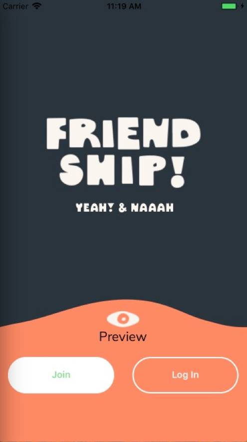
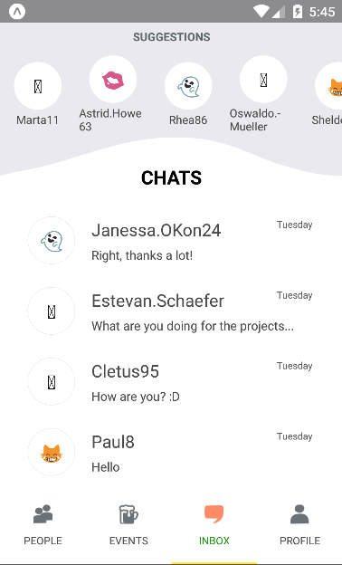
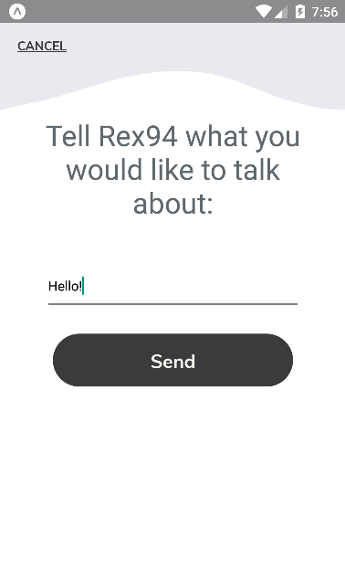
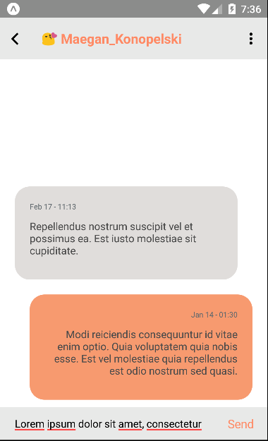

# Friendship App Architecture

## Table of Contents
**[Welcome View](#welcome-view)** 
**[Sign In](#sign-in)** 
**[Sign Up](#sign-up)** 
**[Search View](#search-view)** 
**[People Profile](#people-profile)** 
**[Chat](#chat)** 
**[User's Profile](#user's-profile)** 
**[Components](#components)** 

## Welcome View

**Path**

> src/containers/views/WelcomeView.js

**Component Imported**

> * src/components/Button.js
> * src/components/RoundTab.js

**Functionality**

> * Preview button: redirect the user to PeopleView
> * Join button: redirect the user to SignUpView
> * Log in button: redirect the user to the SignInView

## Sign In

Lorem Ipsum is simply dummy text of the printing and typesetting industry. Lorem Ipsum has been the industry's standard dummy text ever since the 1500s, when an unknown printer took a galley of type and scrambled it to make a type specimen book. It has survived not only five centuries, but also the leap into electronic typesetting, remaining essentially unchanged. It was popularised in the 1960s with the release of Letraset sheets containing Lorem Ipsum passages, and more recently with desktop publishing software like Aldus PageMaker including versions of Lorem Ipsum.

## Sign Up

Lorem Ipsum is simply dummy text of the printing and typesetting industry. Lorem Ipsum has been the industry's standard dummy text ever since the 1500s, when an unknown printer took a galley of type and scrambled it to make a type specimen book. It has survived not only five centuries, but also the leap into electronic typesetting, remaining essentially unchanged. It was popularised in the 1960s with the release of Letraset sheets containing Lorem Ipsum passages, and more recently with desktop publishing software like Aldus PageMaker including versions of Lorem Ipsum.

## Search View

Lorem Ipsum is simply dummy text of the printing and typesetting industry. Lorem Ipsum has been the industry's standard dummy text ever since the 1500s, when an unknown printer took a galley of type and scrambled it to make a type specimen book. It has survived not only five centuries, but also the leap into electronic typesetting, remaining essentially unchanged. It was popularised in the 1960s with the release of Letraset sheets containing Lorem Ipsum passages, and more recently with desktop publishing software like Aldus PageMaker including versions of Lorem Ipsum.

## People Profile

Lorem Ipsum is simply dummy text of the printing and typesetting industry. Lorem Ipsum has been the industry's standard dummy text ever since the 1500s, when an unknown printer took a galley of type and scrambled it to make a type specimen book. It has survived not only five centuries, but also the leap into electronic typesetting, remaining essentially unchanged. It was popularised in the 1960s with the release of Letraset sheets containing Lorem Ipsum passages, and more recently with desktop publishing software like Aldus PageMaker including versions of Lorem Ipsum.

## Chat

### Inbox view (entry point)

**Path**

> src/containers/views/Chat/ChatInbox.js

**Container Imported**

> * src/containers/views/Report/Report.js

**Component Imported**

> * src/components/RoundTab.js
> * src/components/InboxCard.js
> * src/components/SuggestionList.js

**Functionality**

> * Suggestion list:   
>   * Show all the suggested profiles.
>   * Click/Touch on each profile directs user to a [chat request view](#chat-request-view).
> * Chats list:  
>   * Show all the chat conversations with last message and its datetime, name and emoji of the other person, sorted by the latest to the oldest.
>   * Click/Touch on each conversations directs user to a [chat view of that conversation](#chat-view).

### Chat request view

**Path**

> src/containers/views/Chat/ChatRequest.js

**Component Imported**

> * src/components/RoundTab.js

**Functionality**

> * Text input: allow user to type a new message to open the conversation. Empty messages cannot be sent.  
> * "Send" button: direct user to a newly created chatroom with the other person.

### Chat view

**Path**

> src/containers/views/Chat/ChatView.js

**Component Imported**

> * src/components/PopUpMenu.js

**Functionality**

> * Top right corner vertical ellipsis button: drop down/popup menu of several selections related to chat and the other user.
> * Text input: allow user to type a new message. Empty messages cannot be sent.  
> * "Send" button: Send a new message to the other person.

## User's Profile

Lorem Ipsum is simply dummy text of the printing and typesetting industry. Lorem Ipsum has been the industry's standard dummy text ever since the 1500s, when an unknown printer took a galley of type and scrambled it to make a type specimen book. It has survived not only five centuries, but also the leap into electronic typesetting, remaining essentially unchanged. It was popularised in the 1960s with the release of Letraset sheets containing Lorem Ipsum passages, and more recently with desktop publishing software like Aldus PageMaker including versions of Lorem Ipsum.

## Components

Lorem Ipsum is simply dummy text of the printing and typesetting industry. Lorem Ipsum has been the industry's standard dummy text ever since the 1500s, when an unknown printer took a galley of type and scrambled it to make a type specimen book. It has survived not only five centuries, but also the leap into electronic typesetting, remaining essentially unchanged. It was popularised in the 1960s with the release of Letraset sheets containing Lorem Ipsum passages, and more recently with desktop publishing software like Aldus PageMaker including versions of Lorem Ipsum.
