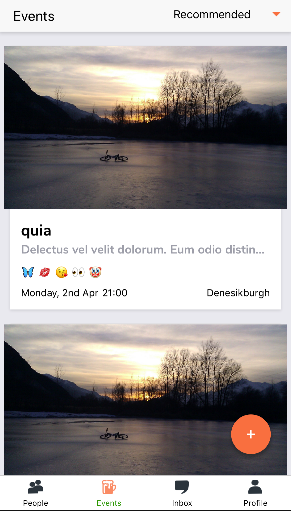

# Friendship App Architecture

## Table of Contents
**[Welcome View](#welcome-view)** 
**[Sign In](#sign-in)** 
**[Sign Up](#sign-up)** 
**[Search View](#search-view)** 
**[People Profile](#people-profile)** 
**[Chat](#chat)** 
**[User's Profile](#user's-profile)** 
**[Events](#events)** 
**[Event Details](#event-details)** 
**[Event Create/Edit](#event-create/edit)** 
**[Components](#components)** 
## Welcome View

**Path**

> src/containers/views/WelcomeView.js

**Component Imported**

> * src/components/Button.js
> * src/components/RoundTab.js

**Functionality**

> * Preview button: redirect the user to PeopleView
> * Join button: redirect the user to SignUpView
> * Log in button: redirect the user to the SignInView

## Sign In

Lorem Ipsum is simply dummy text of the printing and typesetting industry. Lorem Ipsum has been the industry's standard dummy text ever since the 1500s, when an unknown printer took a galley of type and scrambled it to make a type specimen book. It has survived not only five centuries, but also the leap into electronic typesetting, remaining essentially unchanged. It was popularised in the 1960s with the release of Letraset sheets containing Lorem Ipsum passages, and more recently with desktop publishing software like Aldus PageMaker including versions of Lorem Ipsum.

## Sign Up

Lorem Ipsum is simply dummy text of the printing and typesetting industry. Lorem Ipsum has been the industry's standard dummy text ever since the 1500s, when an unknown printer took a galley of type and scrambled it to make a type specimen book. It has survived not only five centuries, but also the leap into electronic typesetting, remaining essentially unchanged. It was popularised in the 1960s with the release of Letraset sheets containing Lorem Ipsum passages, and more recently with desktop publishing software like Aldus PageMaker including versions of Lorem Ipsum.

## Search View

Lorem Ipsum is simply dummy text of the printing and typesetting industry. Lorem Ipsum has been the industry's standard dummy text ever since the 1500s, when an unknown printer took a galley of type and scrambled it to make a type specimen book. It has survived not only five centuries, but also the leap into electronic typesetting, remaining essentially unchanged. It was popularised in the 1960s with the release of Letraset sheets containing Lorem Ipsum passages, and more recently with desktop publishing software like Aldus PageMaker including versions of Lorem Ipsum.

## People Profile

Lorem Ipsum is simply dummy text of the printing and typesetting industry. Lorem Ipsum has been the industry's standard dummy text ever since the 1500s, when an unknown printer took a galley of type and scrambled it to make a type specimen book. It has survived not only five centuries, but also the leap into electronic typesetting, remaining essentially unchanged. It was popularised in the 1960s with the release of Letraset sheets containing Lorem Ipsum passages, and more recently with desktop publishing software like Aldus PageMaker including versions of Lorem Ipsum.

## Chat

### Inbox view (entry point)

**Path**

> src/containers/views/Chat/ChatInbox.js

**Container Imported**

> * src/containers/views/Report/Report.js

**Component Imported**

> * src/components/RoundTab.js
> * src/components/InboxCard.js
> * src/components/SuggestionList.js

**Functionality**

> * Suggestion list:   
>   * Show all the suggested profiles.
>   * Click/Touch on each profile directs user to a [chat request view](#chat-request-view).
> * Chats list:  
>   * Show all the chat conversations with last message and its datetime, name and emoji of the other person, sorted by the latest to the oldest.
>   * Click/Touch on each conversations directs user to a [chat view of that conversation](#chat-view).

### Chat request view

**Path**

> src/containers/views/Chat/ChatRequest.js

**Component Imported**

> * src/components/RoundTab.js

**Functionality**

> * Text input: allow user to type a new message to open the conversation. Empty messages cannot be sent.  
> * "Send" button: direct user to a newly created chatroom with the other person.

### Chat view

**Path**

> src/containers/views/Chat/ChatView.js

**Component Imported**

> * src/components/PopUpMenu.js

**Functionality**

> * Top right corner vertical ellipsis button: drop down/popup menu of several selections related to chat and the other user.
> * Text input: allow user to type a new message. Empty messages cannot be sent.  
> * "Send" button: Send a new message to the other person.

## User's Profile

Lorem Ipsum is simply dummy text of the printing and typesetting industry. Lorem Ipsum has been the industry's standard dummy text ever since the 1500s, when an unknown printer took a galley of type and scrambled it to make a type specimen book. It has survived not only five centuries, but also the leap into electronic typesetting, remaining essentially unchanged. It was popularised in the 1960s with the release of Letraset sheets containing Lorem Ipsum passages, and more recently with desktop publishing software like Aldus PageMaker including versions of Lorem Ipsum.
## Events 

**Path**

> src/containers/views/EventsView.js

**Component Imported**

> * src/components/Events/EventsHeader.js
> * src/components/Events/EventsList.js

**Functionality**

> * Events (Beer) button: redirect the user to Events View container
> * On the page there is a list of all available events loaded. Two Get requests are sent to the database in order to get the list of events as well as list of participants for each event
> * In the top right corner there is a sorting drop-down available. 
> * Sorting contains 5 different options : 
"Recommended" is calculated by utilizing event location, the number of participants, 
common personalities and common yeah&nahs. 
"By Time" sorted by closest by time.
"Smallest first" event with a minimum number of participant is shown at the first place.
"Closes first" closest event by location is first. (Location is calculated with google maps API.(Only distance to the city is counted)).
"My events" is working not like sorting, but like a filter. It means that it's showing only events which you are joining.
> *  Each event card contains a picture of the event and basic information about the event like title, description, participant emojis and date&time
> * By pressing on the Location section the standard map app will be opened with the direction to the event location. 
> * Event Date is highlighted if it's "Today" or "Tomorrow". In all other cases, event date is shown as a day of the week. 

## Event Details

**Path**

> src/containers/views/EventDetailView.js

**Component Imported**

> * src/components/Events/EventTopPart.js
> * src/components/Events/EventBottomPart.js
> * src/components/Events/MyEventModal.js

**Functionality**

> * Event Detail page is opened after pressing one of the events from the list 
> * The page mainly consists of two main parts. Top Part and Bottom. 
> * Top Part contains the basic information about the event like Title, Description, Date, Time and Location. With help of styles, it has a wave shape and contains the picture of the event as well.
> * In order to fetch all required information in the container there are several requests to the backend are done. 
> * On the Top and Bottom of the page user is able to press the button 'Join this', or 'Leave this' in case already joined. 
> * After user joins the event, the page is reloaded and user is added to the participant's list under the host. 
> * Host of the event has a specific markup and it is always in the first place.
> * The user profile page can be accessed by pressing the participant row.  
> * The Bottom part of the page contains 4 Different Sections.
> * "Group Participants" contains all users which are joining event. Red and Blue balls are showing the number of your common yeahs and nahs with the user. 
> * "Group Personalities" contains information about the personalities of the event based on the personalities of the users who join. Circle in the top part shows the number of the each personality for event. 
> * "Top Yeahs" & "Top Naahs" contains information about the top yeahs and top naahs for this event based on the participant preferences. The circle shows the number of each tag for event. 
> * In case when you are the host of the event, instead of  "Join"&"Leave" buttons the button "Manage event" available. 
> * By pressing this button the modal which allows user to open the Edit Page will be opened. 
> * If the event is full (Number of maximum participants exceed), then the user is not able to click the join button. 
> * In the participant's list there are no common yeahs & naahs circles with your own user. 

## Event Create/Edit 

**Path**

> src/containers/views/EventCreateView.js
> src/containers/views/EventEditView.js

**Component Imported**

> * src/components/Events/EventForm.js

**Functionality**

> * For Creating the new one and modifying the existing event there are two containers are user. EventCreateView and EventEditView use the same EventForm component which taking different props based on the mode. 
> * Create Page can be opened by pressing the big "+" circle in the Events List page. 
> * On the New Event page user should specify all required information for the creation of the event. 
> * Required fields in the form are marked with star.
> * "Maximum Participants" section specifies the maximum number of participants which can join the event. After this number is exceeded, users are not able anymore to join the event. 
> * "People Mix" feature contains the information how diverse the event is. 
> * Diversity of the event is calculated based on participants information, personalities and tags. It is calculated in the backend as the percentage of the similarity between host and user who opens the event. 
> * In case when the users similarity is less then diversity value specified by host, then event is not shown for the user. 
> * Picture can be added on the Bottom of the page and it will be an event picture on the background. 
> * After "Create" button is pressed, the event is inserted to the database and user is redirected to the Event Detail Page. 
> * After the user creates an event, it is automatically joining it and it's not possible to leave event anyhow for the host. 
> * For Editing the event, the button "Manage Event" and then "Edit" should be pressed. 
> * On the "Edit Event" page user will get all information about the event populated to the corresponding fields. 
> * It's possible to modify all fields of the event. 
> * On the bottom part, there is "Cancel Event" button which will delete the event from the database and redirect user to Events List page.

## Components

Lorem Ipsum is simply dummy text of the printing and typesetting industry. Lorem Ipsum has been the industry's standard dummy text ever since the 1500s, when an unknown printer took a galley of type and scrambled it to make a type specimen book. It has survived not only five centuries, but also the leap into electronic typesetting, remaining essentially unchanged. It was popularised in the 1960s with the release of Letraset sheets containing Lorem Ipsum passages, and more recently with desktop publishing software like Aldus PageMaker including versions of Lorem Ipsum.

